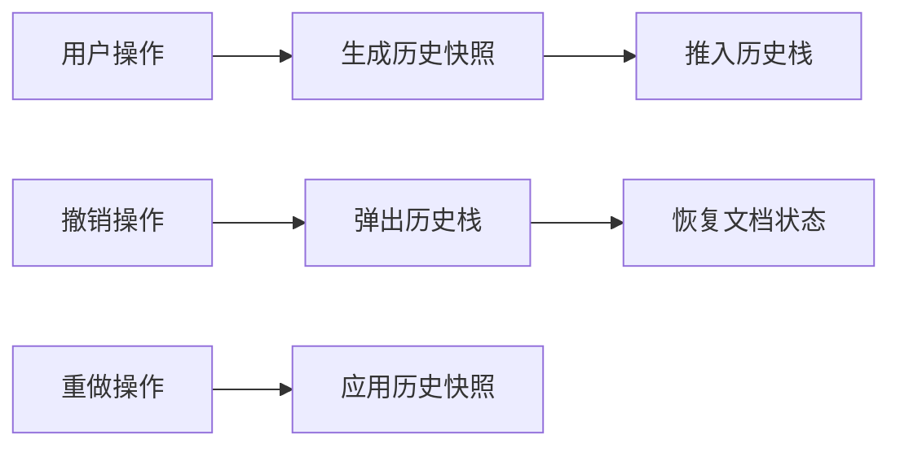

## 1. 产品概述

基于 Vue3 + Vite 开发的双栏/多栏在线文档编辑器，为用户提供专业的文档创作体验，支持富文本编辑、灵活的分栏布局、高效的内容组织和完善的版本管理。

- **主要用途**：专业文档创作、学术论文排版、杂志/报纸风格内容编辑
- **目标用户**：内容创作者、编辑人员、学生、办公人员
- **核心价值**：突破传统单栏编辑限制，提供灵活的多栏布局，兼顾专业排版与易用性

## 2. 核心特性

### 2.1 功能模块

1. **编辑器主界面**：工具栏、分栏编辑区、状态栏
2. **富文本编辑**：文本格式化、标题层级、列表、引用、代码块
3. **分栏管理**：双栏/多栏切换、拖拽调整宽度、栏宽比例锁定
4. **段落操作**：拖拽排序、段落合并拆分、跨栏移动
5. **格式管理**：统一格式设置、格式刷、样式预设
6. **历史记录**：撤销/重做、版本临时缓存、自动保存
7. **文档管理**：导入（Markdown/HTML/JSON）、导出（Markdown/HTML/JSON/PDF）
8. **高级操作**：光标精确定位、跨栏复制粘贴、格式样式隔离

### 2.2 页面详情

| 页面名称 | 模块名称 | 功能描述 |
|---------|---------|---------|
| 编辑器主页面 | 顶部工具栏 | 格式按钮、分栏控制、撤销重做、导入导出 |
| 编辑器主页面 | 分栏编辑区 | 可拖拽调整宽度的多栏编辑区域 |
| 编辑器主页面 | 段落拖拽区 | 支持段落拖拽排序的交互区域 |
| 编辑器主页面 | 格式设置面板 | 统一设置字体、字号、颜色、行高等 |
| 编辑器主页面 | 状态栏 | 显示字数统计、光标位置、保存状态 |

## 3. 核心流程

### 3.1 文档编辑流程

用户打开编辑器 → 选择分栏模式 → 输入/粘贴内容 → 应用文本格式 → 拖拽调整栏宽 → 拖拽排序段落 → 自动保存版本 → 导出文档

### 3.2 撤销重做流程

用户操作 → 记录历史快照 → 执行撤销 → 恢复上一状态 → 执行重做 → 应用下一状态

## 4. 用户界面设计

### 4.1 设计风格

- **设计方向**：极简专业编辑风，融合现代 UI 与传统排版软件的专业性
- **主色调**：深空灰 `#1a1a2e` 作为主背景，搭配象牙白 `#f5f0e8` 编辑区，营造专注的写作氛围
- **强调色**：暖金色 `#d4a574` 用于选中状态和操作按钮，避免过于刺眼的高饱和色
- **字体选择**：
  - 标题：Cormorant Garamond（衬线字体，体现专业感）
  - 正文：Inter（现代无衬线，保证阅读舒适度）
  - 代码：JetBrains Mono（等宽字体，清晰可辨）
- **按钮风格**：微圆角（4px）、轻投影、hover 时微上浮效果
- **布局风格**：清晰的功能分区，编辑区居中性强，工具栏紧凑有序
- **图标风格**：线性图标为主，2px 描边，统一 20×20px 尺寸

### 4.2 页面设计概述

| 页面名称 | 模块名称 | UI 元素 |
|---------|---------|---------|
| 编辑器主页面 | 顶部工具栏 | 固定高度 56px，深色背景，图标按钮分组排列，hover 显示 tooltip |
| 编辑器主页面 | 分栏编辑区 | 白色背景，细边框分隔，拖拽条 4px 宽，hover 变宽高亮 |
| 编辑器主页面 | 段落拖拽区 | 左侧 24px 拖拽手柄，hover 显示拖拽图标，拖拽时半透明效果 |
| 编辑器主页面 | 格式设置面板 | 右侧抽屉式面板，滑入动画 200ms，表单控件垂直排列 |
| 编辑器主页面 | 状态栏 | 底部 28px 高度，灰色小字，右对齐显示状态信息 |

### 4.3 响应式设计

- **桌面端**（≥1280px）：完整工具栏 + 分栏编辑区 + 侧边格式面板
- **平板端**（768px-1279px）：精简工具栏，折叠格式面板为浮动按钮，双栏布局
- **移动端**（<768px）：单栏编辑模式，底部工具栏，手势操作支持

### 4.4 交互动效

- **栏宽调整**：实时预览调整效果，拖拽时有虚线辅助线
- **段落拖拽**：拖拽时段落半透明，目标位置显示插入标记线
- **撤销重做**：状态切换时有淡入淡出过渡（150ms）
- **按钮交互**：hover 时背景色变化 + 轻微上浮（transform: translateY(-1px)）
- **面板展开**：右侧滑入，ease-out 缓动函数
