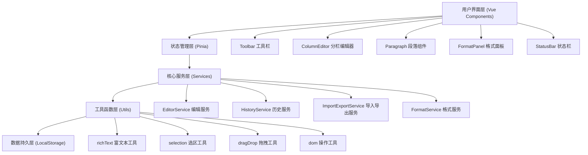

## 1. 架构设计



## 2. 技术描述

- **前端框架**：Vue@3.4 + TypeScript@5.0
- **构建工具**：Vite@5.0
- **状态管理**：Pinia@2.1
- **样式方案**：SCSS + CSS Variables
- **富文本编辑**：基于 contenteditable + 自定义 Selection API
- **拖拽交互**：HTML5 Drag and Drop API + 自定义拖拽逻辑
- **数据持久化**：LocalStorage + IndexedDB（大文档）
- **图标库**：Lucide Vue Next
- **代码规范**：ESLint + Prettier

## 3. 目录结构

```
src/
├── components/              # 组件目录
│   ├── toolbar/            # 工具栏组件
│   │   ├── Toolbar.vue
│   │   ├── ToolbarButton.vue
│   │   └── ToolbarGroup.vue
│   ├── editor/             # 编辑器核心组件
│   │   ├── ColumnEditor.vue
│   │   ├── Column.vue
│   │   ├── Paragraph.vue
│   │   ├── DragHandle.vue
│   │   └── ResizeHandle.vue
│   ├── panel/              # 面板组件
│   │   ├── FormatPanel.vue
│   │   └── ImportExportPanel.vue
│   └── common/             # 通用组件
│       ├── StatusBar.vue
│       └── Modal.vue
├── stores/                 # Pinia 状态管理
│   ├── editor.ts          # 编辑器状态
│   ├── history.ts         # 历史记录状态
│   └── format.ts          # 格式设置状态
├── services/               # 业务服务层
│   ├── EditorService.ts
│   ├── HistoryService.ts
│   ├── ImportExportService.ts
│   └── FormatService.ts
├── utils/                  # 工具函数
│   ├── richText.ts
│   ├── selection.ts
│   ├── dragDrop.ts
│   ├── dom.ts
│   └── debounce.ts
├── types/                  # TypeScript 类型定义
│   ├── editor.ts
│   ├── document.ts
│   └── format.ts
├── composables/            # Vue 组合式函数
│   ├── useEditor.ts
│   ├── useHistory.ts
│   ├── useDragDrop.ts
│   └── useFormat.ts
├── styles/                 # 全局样式
│   ├── variables.scss
│   ├── mixins.scss
│   └── reset.scss
├── App.vue
└── main.ts
```

## 4. 核心数据模型

### 4.1 文档数据结构

```typescript
interface Document {
  id: string;
  title: string;
  createdAt: number;
  updatedAt: number;
  columns: Column[];
  columnCount: 1 | 2 | 3;
  columnWidths: number[];
  globalFormat: FormatConfig;
}

interface Column {
  id: string;
  width: number;
  paragraphs: Paragraph[];
}

interface Paragraph {
  id: string;
  type: 'text' | 'heading' | 'list' | 'quote' | 'code' | 'image';
  content: string;
  format: FormatConfig;
  metadata?: Record<string, any>;
}

interface FormatConfig {
  fontFamily: string;
  fontSize: number;
  fontWeight: 'normal' | 'bold';
  fontStyle: 'normal' | 'italic';
  textDecoration: 'none' | 'underline' | 'line-through';
  color: string;
  backgroundColor: string;
  textAlign: 'left' | 'center' | 'right' | 'justify';
  lineHeight: number;
  letterSpacing: number;
  textIndent: number;
}
```

### 4.2 历史记录数据结构

```typescript
interface HistoryState {
  past: HistorySnapshot[];
  future: HistorySnapshot[];
  current: HistorySnapshot | null;
  maxHistory: number;
}

interface HistorySnapshot {
  id: string;
  timestamp: number;
  document: Document;
  selection: SelectionState;
  description: string;
}

interface SelectionState {
  columnId: string;
  paragraphId: string;
  startOffset: number;
  endOffset: number;
}
```

## 5. 状态管理设计

### 5.1 Editor Store

| 状态 | 类型 | 说明 |
|-----|------|-----|
| document | Document | 当前编辑的文档 |
| activeColumnId | string | 当前激活的栏 ID |
| activeParagraphId | string | 当前激活的段落 ID |
| selection | SelectionState | 当前选区状态 |
| isDragging | boolean | 是否正在拖拽 |
| dragData | DragData | 拖拽数据 |

### 5.2 History Store

| 状态 | 类型 | 说明 |
|-----|------|-----|
| past | HistorySnapshot[] | 历史记录栈 |
| future | HistorySnapshot[] | 重做栈 |
| current | HistorySnapshot | 当前状态 |
| maxHistory | number | 最大历史记录数 |

### 5.3 Format Store

| 状态 | 类型 | 说明 |
|-----|------|-----|
| globalFormat | FormatConfig | 全局格式设置 |
| selectionFormat | FormatConfig | 选区格式 |
| formatPresets | FormatPreset[] | 格式预设 |
| isPanelOpen | boolean | 格式面板是否展开 |

## 6. 核心功能实现方案

### 6.1 富文本编辑
- 使用 `contenteditable` 属性实现可编辑区域
- 通过 `document.execCommand` 或自定义操作实现格式化
- 使用 `Selection` 和 `Range` API 管理光标和选区
- 防抖处理输入事件，避免频繁状态更新

### 6.2 分栏拖拽调整宽度
- 使用 CSS Flexbox 实现多栏布局
- 拖拽条监听 `mousedown` / `mousemove` / `mouseup` 事件
- 实时更新 `columnWidths` 状态
- 使用 `requestAnimationFrame` 优化拖拽性能

### 6.3 段落拖拽排序
- 使用 HTML5 Drag and Drop API
- `dragstart` 记录拖拽段落信息
- `dragover` 计算目标位置并显示插入标记
- `drop` 执行段落移动并记录历史

### 6.4 撤销/重做
- 采用命令模式，每次操作生成快照
- 双栈结构管理历史（past / future）
- 防抖合并连续输入操作
- 支持键盘快捷键 Ctrl+Z / Ctrl+Shift+Z

### 6.5 版本临时缓存
- LocalStorage 定时自动保存（30秒间隔）
- 页面关闭前自动保存
- 支持多版本缓存，可恢复历史版本
- IndexedDB 存储大文档内容

### 6.6 文档导入导出
- **Markdown**：使用 marked + turndown 实现双向转换
- **HTML**：原生 DOM 解析与序列化
- **JSON**：直接序列化文档对象
- **PDF**：使用 html2canvas + jsPDF 客户端生成

## 7. 性能优化策略

1. **虚拟滚动**：段落数量超过 50 条时启用虚拟滚动
2. **防抖节流**：输入事件防抖 100ms，滚动事件节流 16ms
3. **懒渲染**：非可视区域段落延迟渲染
4. **状态批量更新**：避免频繁的响应式更新
5. **内存管理**：及时清理历史记录，限制最大历史数
6. **选区优化**：缓存选区状态，避免重复计算

## 8. 兼容性处理

1. **浏览器兼容性**：Chrome 90+ / Firefox 88+ / Safari 14+
2. **Selection API 兼容**：封装统一的选区操作接口
3. **富文本格式兼容**：使用内联样式而非 CSS 类，保证导出一致性
4. **剪贴板兼容**：处理不同浏览器的剪贴板数据格式
